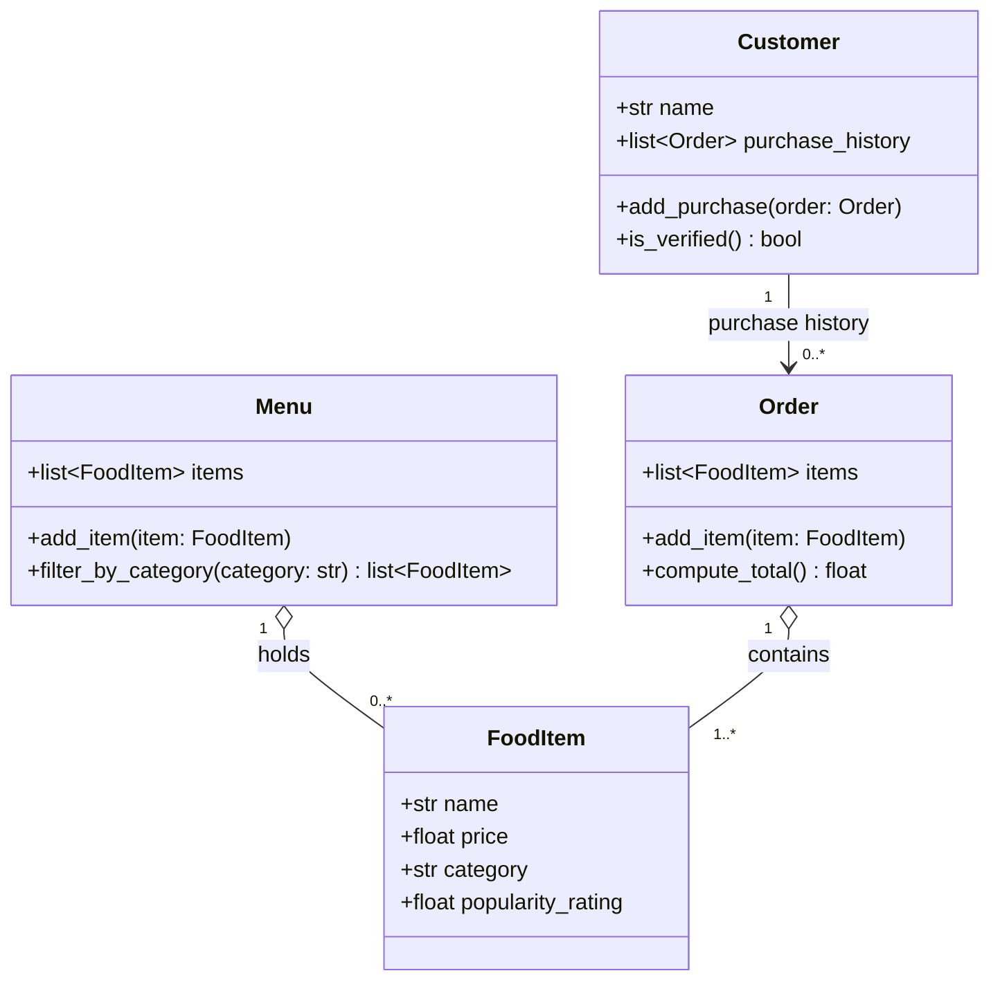

# ByteBites Class Diagram (Draft)

```mermaid
classDiagram
    class Customer {
        +str name
        +list~Order~ purchase_history
        +add_purchase(order: Order)
        +is_verified() bool
    }

    class FoodItem {
        +str name
        +float price
        +str category
        +float popularity_rating
    }

    class Menu {
        +list~FoodItem~ items
        +add_item(item: FoodItem)
        +filter_by_category(category: str) list~FoodItem~
    }

    class Order {
        +list~FoodItem~ items
        +add_item(item: FoodItem)
        +compute_total() float
    }

    Customer "1" --> "0..*" Order : purchase history
    Menu "1" o-- "0..*" FoodItem : holds
    Order "1" o-- "1..*" FoodItem : contains
```
